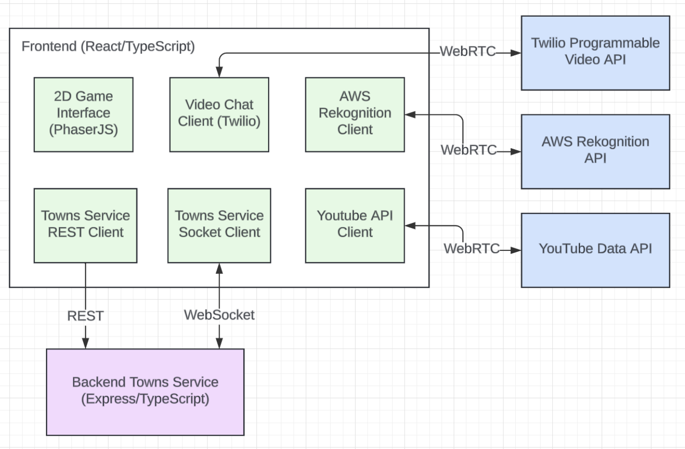

# Covey.Town

Covey.Town provides a virtual meeting space where different groups of people can have simultaneous video calls, allowing participants to drift between different conversations, just like in real life. Covey.Town also allows users to have fun with each other by listening to music together, dancing, and expressing their real life emotions through their avatars.

The figure above depicts the high-level architecture of Covey.Town.
The frontend client (in the `frontend` directory of this repository) uses the [PhaserJS Game Library](https://phaser.io) to create a 2D game interface, using tilemaps and sprites.
The frontend implements video chat using the [Twilio Programmable Video](https://www.twilio.com/docs/video) API, and that aspect of the interface relies heavily on [Twilio's React Starter App](https://github.com/twilio/twilio-video-app-react). Twilio's React Starter App is packaged and reused under the Apache License, 2.0. The frontend implements song searching using the [Youtube Data API v3](https://developers.google.com/youtube/v3/docs
). The frontend also implements emotion recognition using the [Amazon Rekognition API](https://docs.aws.amazon.com/rekognition/latest/APIReference/API_Emotion.html
).

A backend service (in the `townService` directory) implements the application logic: tracking which "towns" are available to be joined, and the state of each of those towns.

## Running this app locally

Running the application locally entails running both the backend service and a frontend.

### Setting up the backend

To run the backend, you will need a Twilio account. Twilio provides new accounts with $15 of credit, which is more than enough to get started.
To create an account and configure your local environment:

1. Go to [Twilio](https://www.twilio.com/) and create an account. You do not need to provide a credit card to create a trial account.
2. Create an API key and secret (select "API Keys" on the left under "Settings")
3. Create a `.env` file in the `townService` directory, setting the values as follows:

| Config Value            | Description                               |
| ----------------------- | ----------------------------------------- |
| `TWILIO_ACCOUNT_SID`    | Visible on your twilio account dashboard. |
| `TWILIO_API_KEY_SID`    | The SID of the new API key you created.   |
| `TWILIO_API_KEY_SECRET` | The secret for the API key you created.   |
| `TWILIO_API_AUTH_TOKEN` | Visible on your twilio account dashboard. |

After configuring the backend, run `npm install`.

### Configuring the frontend

Create a `.env` file in the `frontend` directory, with the line: `NEXT_PUBLIC_TOWNS_SERVICE_URL=http://localhost:8081` (if you deploy the towns service to another location, put that location here instead).

For ease of debugging, you might also set the environmental variable `NEXT_PUBLIC_TOWN_DEV_MODE=true`. When set to `true`, the frontend will automatically connect to the town with the friendly name "DEBUG_TOWN" (creating one if needed), and will *not* try to connect to the Twilio API. This is useful if you want to quickly test changes to the frontend (reloading the page and re-acquiring video devices can be much slower than re-loading without Twilio).

You will need to create an Youtube Data API key.
1. Make sure you have a Google account. If you don't have one yet, you will have to create one.
2. Log in to to [Google Cloud Console](https://console.cloud.google.com/getting-started) with your Google account.
3. On the sidebar, click on "APIs & Services".
4. You should be brought to the page "Enabled APIs & services", and on the page there is "CREATE PROJECT" button, click on that.
5. Give it a project name like "Covey.town" and leave the Location as "No organization"
6. After creating the project, you will be taken to dashboard with many information like Project Info, Resources, and so on.
7. On the sidebar, navigate to APIs & Services > Library.
8. On the library page, find the section titled YouTube and select YouTube Data API v3.
9. You will arrive att the YouTube Data API page, click the blue button that says "Enable" to enable the API.
10. On the sidebar, navigate to APIs & Services > Credentials
11. Click on "CREATE CREDENTIALS" near the top and select "API key". It will automatically generate an API key for you. **Copy the key** and keep it somewhere for now.

Now that you have generated the key, you have to add it to the `.env` file in the `frontend` directory that you created, with the line `NEXT_PUBLIC_TOWN_YOUTUBE_API_KEY={API_key}`, where you replace `{API_key}` with the API key you created and copied just now.

You will also need to create an AWS access key. First, follow this [article](https://docs.aws.amazon.com/rekognition/latest/dg/setting-up.html) to set up an AWS account and create a user. Then, we need to create an access key for the user you created:
1. Sign in to the AWS Management Console and open the IAM console at https://console.aws.amazon.com/iam/.
2. In the navigation pane, choose Users.
3. Choose the name of the user you created previously.
4. Choose the Security credentials tab.
5. Choose Create access key. Then choose Download .csv file to save the access key ID and secret access key to a CSV file on your computer. Store the file in a secure location. You will not have access to the secret access key again after this dialog box closes. After you have downloaded the CSV file, choose Close.

Now add the following values to the `.env` file in the `frontend` directory that you created.
| Config Value                            | Description                               |
| --------------------------------------- | ----------------------------------------- |
| `NEXT_PUBLIC_TOWN_AWS_DEV_MODE`         | Set as `false`.                           |
| `NEXT_PUBLIC_TOWN_AWS_ACCESS_KEY_ID`    | The access key id you created above.      |
| `NEXT_PUBLIC_TOWN_AWS_SECRET_ACCESS_KEY`| The secret access key you created above.  |
| `NEXT_PUBLIC_TOWN_AWS_REGION`           | Set as `us-east-1`.                       |

After configuring the frontend, run `npm install`.

Lastly, navigate to the root directory and run `npm install` again.

### Starting the backend

Once your backend is configured, you can start it by running `npm start` in the `townService` directory.
The backend will automatically restart if you change any of the files in the `townService/src` directory.

### Running the frontend

Then, to run the frontend, run `npm run dev`. After several moments (or minutes, depending on the speed of your machine), a browser will open with the frontend running locally.
The frontend will automatically re-compile and reload in your browser if you change any files in the `frontend/src` directory.

### Dependencies

Simply running `npm install` in all three folders should install all needed dependencies. However, if you run into errors such that the proper dependencies are not properly installed, run the following commands `npm install aws-sdk` (for installing AWS SDK) and `npm install react-icons` (for installing React icons).

## Running the app remotely

Go to the link https://covey-jam-front.onrender.com/ to access and run the app.
